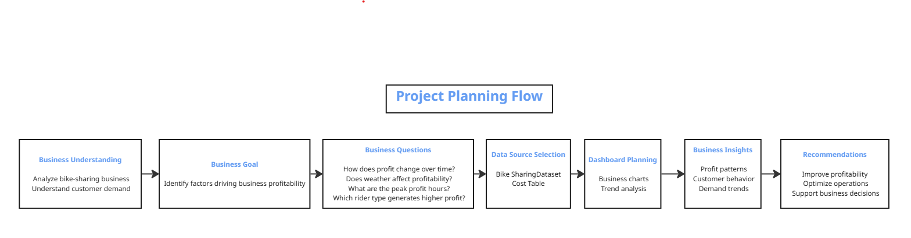
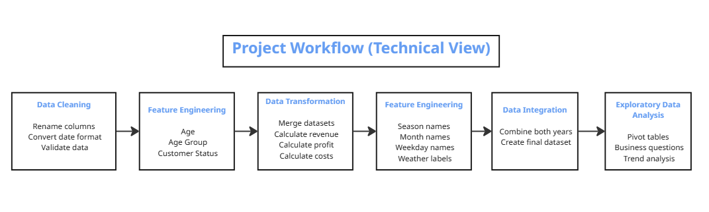
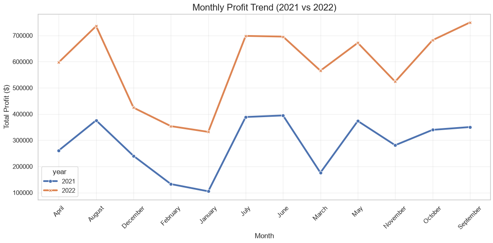
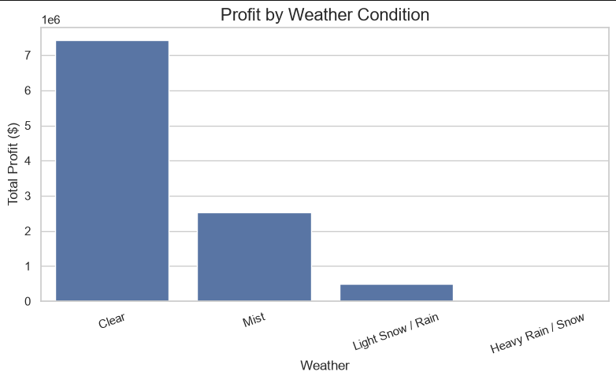
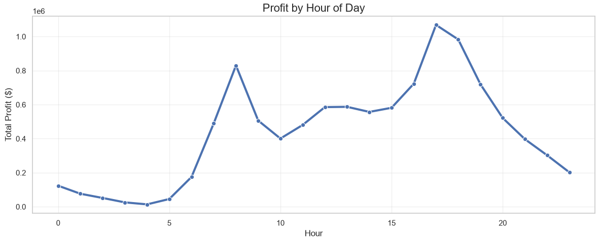
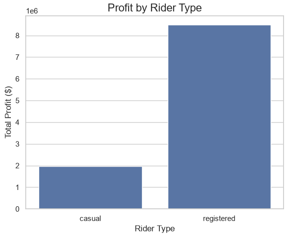

# End-to-End Bike Sharing Profitability Analysis Using Python

This project demonstrates a complete end-to-end data analytics workflow using Python, from raw data preparation to business insights and visualization.


## Business Domain

Bike sharing systems provide short-term bicycle rentals through automated stations distributed across a city. Customers can rent a bicycle from one station and return it to another, making the service a convenient transportation option for commuting, leisure, and short-distance travel.

For bike-sharing companies, profitability depends on understanding customer demand and the factors that influence rental activity. Weather conditions, seasonal changes, time of day, holidays, and customer type can all affect the number of rentals and overall business performance.

This project analyzes two years of operational bike-sharing data to identify the key drivers of profitability and support business decisions through data analysis and visualization.

---

## Project Overview

This is an end-to-end Data Analysis project developed entirely in Python. The project follows the complete analytics workflow, starting from loading raw data and ending with business insights and visualizations.

The analysis combines operational rental data with pricing information to calculate revenue, cost, and profit for every rental record. After preparing the dataset, exploratory data analysis (EDA) is performed to answer real business questions related to profitability.

---

## Business Problem

The company wants to understand which factors have the greatest impact on business profitability. Although rental data is available, management lacks clear insights into how profit changes over time and how customer behavior, weather conditions, and rental patterns influence financial performance.

Without these insights, it becomes difficult to optimize pricing strategies, marketing campaigns, and operational planning.

---

## Project Objectives

- Analyze business profitability over a two-year period.
- Identify the factors that influence total profit.
- Understand how weather conditions affect rental demand.
- Discover peak rental hours throughout the day.
- Compare the profitability of Casual and Registered customers.
- Provide actionable business recommendations based on data analysis.

---

## Business Questions

1. How has business profitability changed over the two-year period?

2. How do weather conditions affect bike rental demand and profitability?

3. What are the peak rental hours throughout the day?

4. Which customer type generates higher profitability: Casual or Registered?

---

## Business Planning Workflow

The project followed a business-first approach where each analytical step was designed to answer specific business questions and support the overall business goal.

<p align="center">

</p>

---

## Technical Workflow

The following workflow summarizes the complete technical implementation of the project, from loading the raw data to generating business insights and visualizations.

<p align="center">

</p>

---

## Dataset Information

**Dataset Name**

Bike Sharing Dataset
Hourly bike rental records collected over two consecutive years.

**Source**

UCI Machine Learning Repository

**Files**

- bike_share_yr_0.csv
- bike_share_yr_1.csv
- cost_table.csv

**Dataset Description**

The dataset contains hourly bike rental records collected over two consecutive years. Each record includes information about the rental time, weather conditions, season, customer type, and the total number of rented bikes.

The cost table provides pricing and operational cost information for each year, allowing revenue, total cost, and profit to be calculated.

---

## Tools & Technologies

Programming Language

- Python

Libraries

- Pandas
- NumPy
- Matplotlib
- Seaborn

Development Environment

- Jupyter Notebook
- Visual Studio Code

Version Control

- Git
- GitHub

---

## Methodology

### 1. Business Understanding

Defined the business goal and translated it into measurable business questions.

---

### 2. Data Collection

Loaded the two yearly datasets together with the cost table.

---

### 3. Data Profiling

Performed an initial assessment of the data by checking:

- Dataset structure
- Data types
- Missing values
- Duplicate records
- Value distributions
- Summary statistics

---

### 4. Data Cleaning

Prepared the data for analysis by:

- Renaming columns
- Converting the date column to datetime format
- Validating data types
- Verifying missing values
- Checking duplicate records

---

### 5. Data Transformation

Created a unified analytical dataset by:

- Merging the yearly datasets
- Joining the cost table
- Calculating revenue
- Calculating total cost
- Calculating profit per ride
- Calculating total profit

---

### 6. Feature Engineering

Created additional business-friendly features to simplify the analysis, including:

- Season names
- Month names
- Weekday names
- Weather condition names
- Business labels for holidays and working days

To improve readability and simplify business analysis, several new features were created from the original dataset.

| Feature | Description |
|----------|-------------|
| price | Rental price per ride based on the corresponding year |
| COGS | Cost of Goods Sold per ride |
| profit_per_ride | Profit generated from a single ride (Price − COGS) |
| revenue | Total revenue generated for each record (Riders × Price) |
| total_cost | Total operational cost for each record (Riders × COGS) |
| total_profit | Total profit for each record (Revenue − Total Cost) |
| season_name | Season names replacing numerical season codes |
| month_name | Month names replacing numerical month values |
| weekday_name | Weekday names replacing numerical weekday values |
| weather_name | Business-friendly weather condition names |

---

### 7. Exploratory Data Analysis (EDA)

Used pivot tables and aggregation techniques to answer the business questions and identify profitability patterns.

---

### 8. Data Visualization

Built business-oriented visualizations using Matplotlib and Seaborn to communicate findings clearly.

---

### 9. Insight Generation

Summarized the analytical findings into business insights and practical recommendations.

---

## Dashboard / Results Preview

The following visualizations answer the project's business questions and summarize the key analytical findings.

### 1. Business Profit Trend

Tracks total monthly profit across the two-year period to evaluate overall business growth.

<p align="center">

</p>

---

### 2. Profit by Weather Condition

Compares profitability under different weather conditions to understand how weather influences customer demand.

<p align="center">

</p>

---

### 3. Business Peak Hours

Identifies the hours generating the highest profit to support operational planning.

<p align="center">

</p>

---

### 4. Customer Profitability Analysis

Compares the contribution of Casual and Registered customers to total profitability.

<p align="center">

</p>

---

## Key Performance Indicators (KPIs)

The analysis focuses on the following business KPIs:

- Total Revenue
- Total Cost
- Total Profit
- Profit Margin
- Profit per Ride
- Total Riders
- Average Profit per Ride

---

## Key Insights

- Business profitability increased significantly during the second year.
- Adverse weather conditions reduced rental demand and overall profitability.
- Rental demand was concentrated during specific hours of the day, creating clear operational peak periods.
- Registered customers generated a considerably larger share of total business profit than Casual customers.

---

## Business Recommendations

Based on the analysis, the following recommendations can help improve business performance:

- Increase bike availability and operational capacity during peak demand hours.
- Launch targeted marketing campaigns during low-demand periods to improve utilization.
- Expand customer loyalty programs to convert Casual riders into Registered members.
- Align operational planning with seasonal demand and weather patterns to maximize profitability.

---

## Project Structure

```text
Bike-Sharing-Profitability-Analysis/
│
├── 01-data/
│   ├── bike_share_yr_0.csv
│   ├── bike_share_yr_1.csv
│   └── cost_table.csv
│
├── 02-python/
│   └── Bike_Share_Analysis.ipynb
│
├── 03-processed-data/
│   └── bike_share_analysis.csv
│
├── 04-assets/
│   ├── cover.png
│   ├── profit_trend.png
│   ├── weather_profit.png
│   ├── peak_hours.png
│   ├── rider_type.png
│   ├── project_planning_flow.png
│   └── Project_Workflow_(Technical_View).png
│
├── README.md
└── .gitignore
```

---

## Project Environment

The project was developed using a dedicated Conda environment to ensure package compatibility and reproducibility.

### Create Environment

```bash
conda create -n bike_sharing python=3.12
```

### Activate Environment

```bash
conda activate bike_sharing
```

### Install Required Packages

```bash
conda install pandas numpy matplotlib seaborn jupyter
```

Or using pip:

```bash
pip install pandas numpy matplotlib seaborn jupyter
```

### Launch Jupyter Notebook

```bash
jupyter notebook
```
## Environment

- Python 3.12.13
- Pandas 3.0.3
- NumPy 2.5.1
- Matplotlib 3.11.0
- Seaborn 0.13.2
- Jupyter Notebook
- Miniconda
---

## How to Run the Project

1. Clone the repository.

2. Install the required libraries.

```bash
pip install pandas numpy matplotlib seaborn
```

3. Open the Jupyter Notebook.

4. Run all notebook cells in order.

5. Review the generated visualizations and business insights.

---

## Future Improvements

Possible enhancements for future versions of the project include:

- Build an interactive web dashboard using Streamlit.
- Deploy the project as an online analytics application.
- Develop forecasting models for future demand.
- Integrate live weather data for real-time analysis.

---

## Author

**Khaled Taha Fahmy**

Data Analyst | AI Automation Engineer

### Contact

- LinkedIn: **
- GitHub: **
- Portfolio: **
- Email: **
